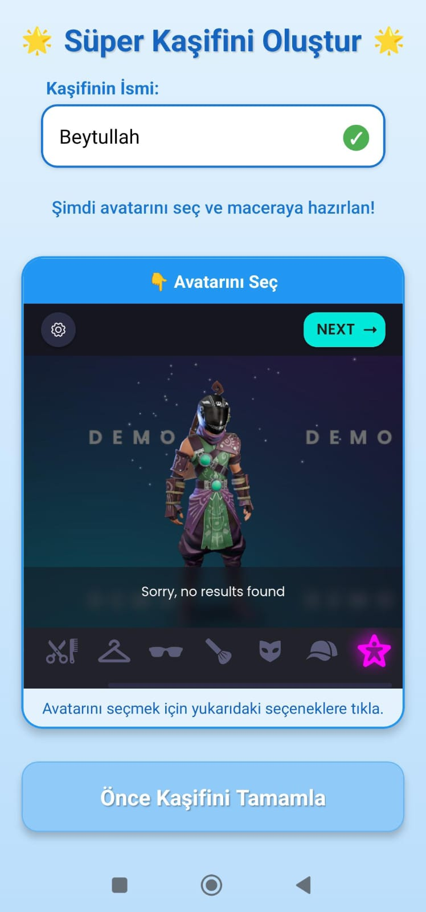
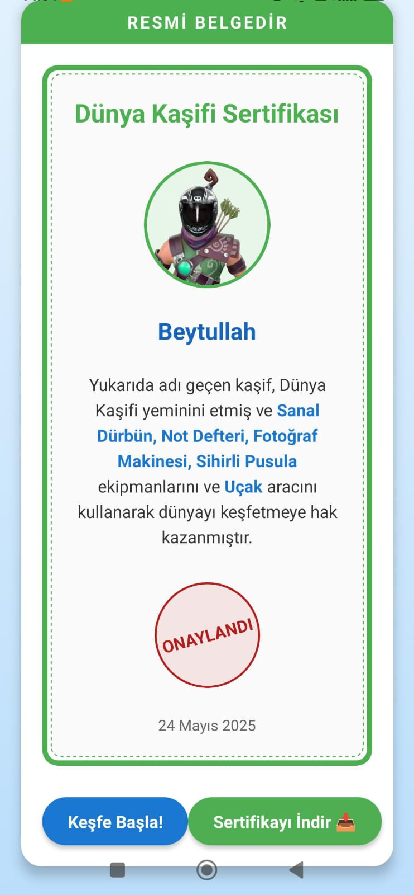
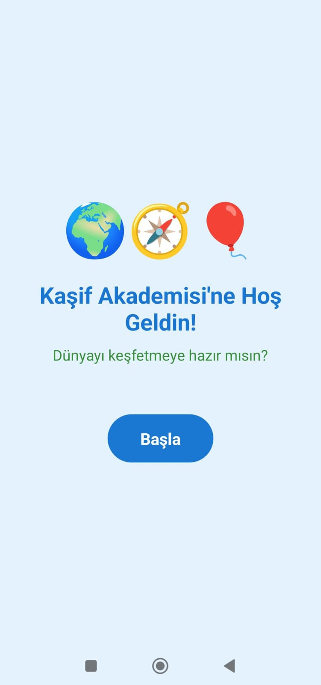
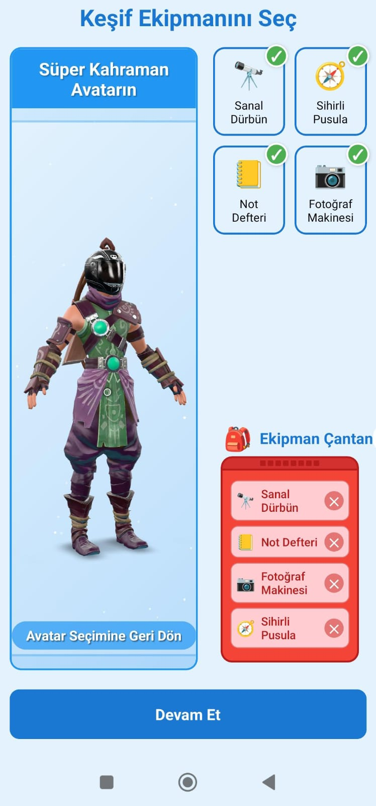
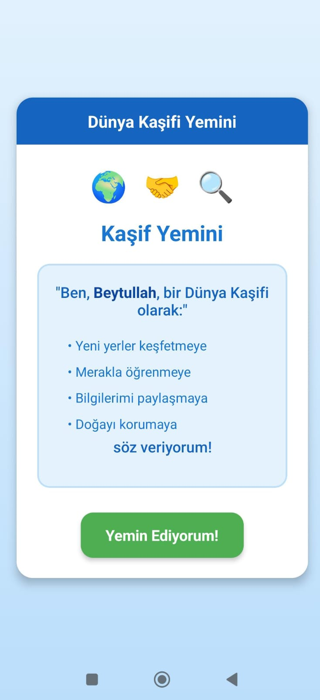
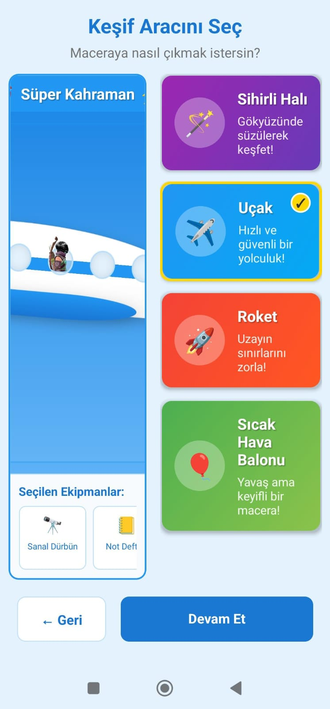
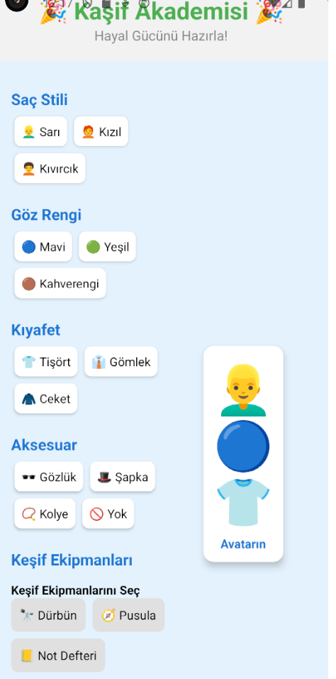
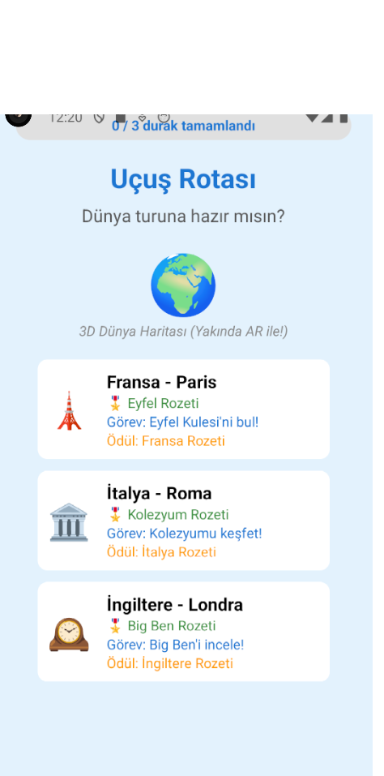
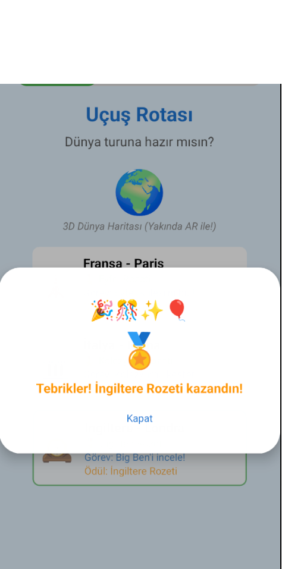
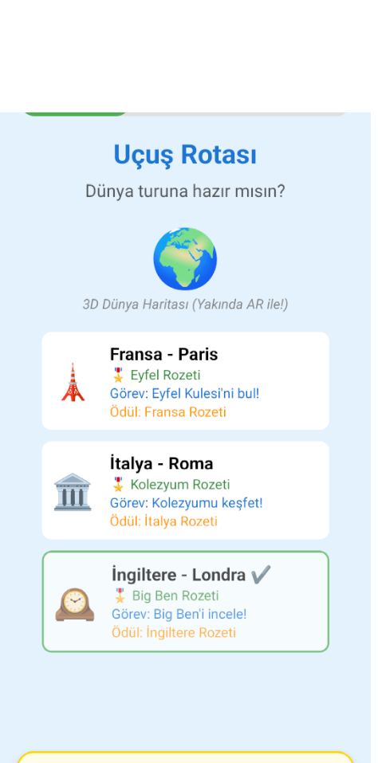

# 🌍 Dünya Kaşifi - Artırılmış Gerçeklik Temelli Mobil Uygulama

  
  
  

## 📱 Uygulama Hakkında

**Dünya Kaşifi**, çocukların artırılmış gerçeklik (AR) teknolojisi ile dünyayı keşfetmelerini sağlayan eğitici ve eğlenceli bir mobil uygulamadır. Uygulama, çocukların coğrafya, kültür ve dil öğrenimini interaktif bir deneyimle birleştirir.

## ✨ Öne Çıkan Özellikler

### 🎮 Oyuna Giriş ve Karakter Oluşturma

  
  

- **Kaşif Akademisi**: Renkli ve eğlenceli giriş animasyonu
- **Avatar Tasarımı**: Saç stili, göz rengi, kıyafet ve aksesuar seçenekleri
- **Keşif Ekipmanları**: Sanal dürbün, sihirli pusula, not defteri, fotoğraf makinesi
- **Favori Araç Seçimi**: Sihirli halı, uçak, roket veya sıcak hava balonu
- **Kaşif Sertifikası**: Eğlenceli "Kaşif Yemini" ve dijital sertifika

### 🗺️ Uçuş Rotası Tanıtımı

  
  

- **Dinamik 3D Dünya Haritası**: Gerçek uçuş rotası üzerinde
- **Renkli Duraklar**: Ülkeler ve şehirler ilgi çekici ikonlarla işaretlenir
- **Hedefler ve Ödüller**: Her durakta kazanılabilecek rozetler
- **Görev Listesi**: Uçuş süresince tamamlanabilecek görevler

### 🎯 İnteraktif Görevler ve Mini Oyunlar

#### 🌍 Coğrafi Keşifler
- **3D Haritalar**: Ülkelerin detaylı 3D haritaları
- **AR Modeller**: Eyfel Kulesi, Kolezyum, Big Ben gibi ünlü yapılar
- **Harita Dedektifi**: Gizlenmiş lokasyonları bulma oyunu
- **Bilgi Kartları**: Dağlar, nehirler ve şehirler hakkında bilgiler

#### 🎭 Kültürel Maceralar
- **Geleneksel Kıyafetler**: Her ülkenin kıyafetlerini avatarına giydirme
- **Yöresel Yemekler**: Toplama ve tanıma oyunu
- **Kültürel Semboller**: Eşleştirme görevleri

#### 🗣️ Dil Öğrenme Aktiviteleri
- **Temel Kelimeler**: Selamlaşma, sayı, renk gibi basit kelimeler
- **Telaffuz Oyunları**: Dil eğitimi destekli oyunlar

#### ☁️ Pencere Görünümü Zenginleştirme
- **AR Bulutlar**: Üzerinde uçan hayvanlar ve fantastik figürler
- **Gerçek Zamanlı Görüntüler**: Şehirlerin önemli yapıları
- **Bulut Boyama**: Etkileşimli şekil oluşturma oyunları

#### 🎮 Mini Oyunlar
- **Gökyüzü Matematik Yarışması**: Uçuş yüksekliği ve mesafe problemleri
- **Hava Durumu Tahmincisi**: Eğlenceli meteorolojik bilgiler

### 📚 Eğitim ve İlerleme Sistemi

  
  

#### 🛂 Kaşif Pasaportu
- **Özel Damgalar**: Her ülke için özel damgalar
- **Dil Pulları**: Öğrenilen diller için pullar
- **Görev Kayıtları**: Tamamlanan görevlerin kaydı

#### 🏆 Ödül Mekanizması
- **Süper Kaşif Sistemi**: Seviye bazlı ilerleme
- **Dijital Hatıralar**: Özel anılar ve aksesuarlar

### 🔒 Güvenlik ve Konfor Özellikleri

- **Göz Sağlığı**: 20 dakikada bir dinlendirme hatırlatıcıları
- **Doğru Pozisyon**: Oturma pozisyonu önerileri
- **Ebeveyn Kontrolü**: İçerik filtreleme ve süre kontrolü

### 🎉 Uçuş Sonu Deneyimi

- **Seyahat Günlüğü**: Dijital günlük oluşturma
- **Başarı Özeti**: Kazanılan başarıların özeti
- **Macera Sınavı**: Eğlenceli kapanış aktivitesi

## 🛠️ Teknik Özellikler

- **Platform**: React Native / Expo
- **AR Teknolojisi**: Artırılmış Gerçeklik desteği
- **3D Grafikler**: Üç boyutlu harita ve model desteği
- **Çoklu Dil**: Türkçe ve İngilizce dil desteği
- **Offline Çalışma**: Temel özellikler çevrimdışı kullanılabilir

## 📱 Ekran Görüntüleri

  
  
  
  
  

## 🚀 Kurulum

Detaylı kurulum rehberi için bkz: [installation.md](./installation.md)

## 📥 İndirme

Uygulamayı indirmek için [buraya tıklayın](https://brahimcevik.github.io/kids-explorer-armslt.github.io/#download).

## 🤝 Katkıda Bulunma

1. Bu repository'yi fork edin
2. Yeni bir branch oluşturun (`git checkout -b feature/yeni-ozellik`)
3. Değişikliklerinizi commit edin (`git commit -am 'Yeni özellik eklendi'`)
4. Branch'inizi push edin (`git push origin feature/yeni-ozellik`)
5. Pull Request oluşturun

## 📄 Lisans

Bu proje MIT lisansı altında lisanslanmıştır. Detaylar için [LICENSE](LICENSE) dosyasına bakın.

## 📞 İletişim

## 👥 Geliştirici Ekip
- Scrum Master: İbrahim Çevik
- Backend: Yusuf Emre Deniz
- Frontend & Proje Yürütme Yardımcısı: Beytullah Gülaç
- Tester: Kamuran Danış

- **GitHub**: [@brahimcevik](https://github.com/brahimcevik)
- **Proje Linki**: [https://github.com/brahimcevik/DunyaKasifiExpo](https://github.com/brahimcevik/DunyaKasifiExpo)

### 🌐 Projenin Web Hali
[https://brahimcevik.github.io/kids-explorer-armslt.github.io/](https://brahimcevik.github.io/kids-explorer-armslt.github.io/)

## 🙏 Teşekkürler

Bu projeyi mümkün kılan tüm açık kaynak topluluğuna ve katkıda bulunanlara teşekkür ederiz.

## 📄 Döküman
[Dünya Kaşifi – AR Uygulaması Proje Dökümanı](https://docs.google.com/document/d/1z3CIYulB6Qdm4Li8Qk8ne23KYxuMSWZYknpDOaxmt3Y/edit?usp=sharing)

---

  <strong>🌟 Dünyayı keşfetmeye hazır mısın? 🌟</strong>

 